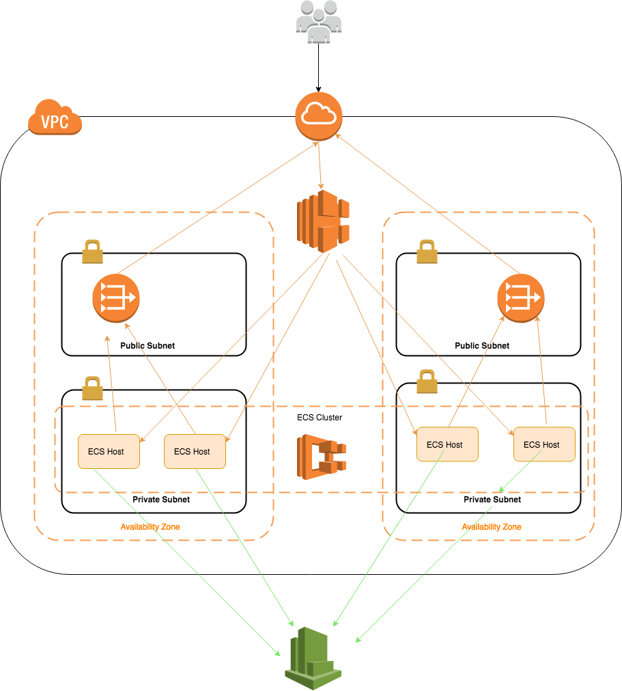

## Architecture

The repository consists of a set of nested templates that deploy the following:

 - A tiered VPC with public and private subnets, spanning an AWS region.
 - A highly available ECS cluster deployed across two Availability Zones in an Auto Scaling] group and that are AWS SSM enabled.
 - A pair of NAT gateways (one in each zone) to handle outbound traffic.
 - Two interconnecting microservices deployed as ECS services (website-service and product-service). 
 - An [Application Load Balancer ALB to the public subnets to handle inbound traffic.
 - ALB path-based routes for each ECS service to route the inbound traffic to the correct service.
 - Centralized container logging with Amazon CloudWatch Logs.
 - A Lambda Function and Auto Scaling Lifecycle Hook to drain Tasks from your Container Instances when an Instance is selected for Termination in your Auto Scaling Group.

### Deploy multiple environments

Just add the stack name with Env name(dev, test, production) and deploy another CloudFormation stack. Stacks will add prefixed to all taggable resources so you can distinguish the different environment resources in the AWS Management Console. 

### Configuration
master.yaml is a master CloudFormation Stack that contains 6 other nested stacks. Most Parameters are set in master.yaml file and passed through nested stacks. 

### Launch this CloudFormation stack in your account:

| AWS Region | Short name | | 
| -- | -- | -- |
| US East (Ohio) | us-east-2 |  |

| Asia Pacific (Sydney) | ap-southeast-2 |  |

### TO DO
- finalise CI/CD and Test
- add another listener for HTTP tO HTTPS redirection in Load Balancer. It requires another Load Balancer Listener to redired http to https then https forward to target group. The redirection need to have a SslPolicy, Certificates, and DefaultActions should be redirect

	HttpToHttpsListener:
		Type: AWS::ElasticLoadBalancingV2::Listener
		Properties: 
		  Certificates:
		    - Certificate
		  DefaultActions:
		    - Action
		  LoadBalancerArn: String
		  Port: Integer
		  Protocol: String
		  SslPolicy: String

